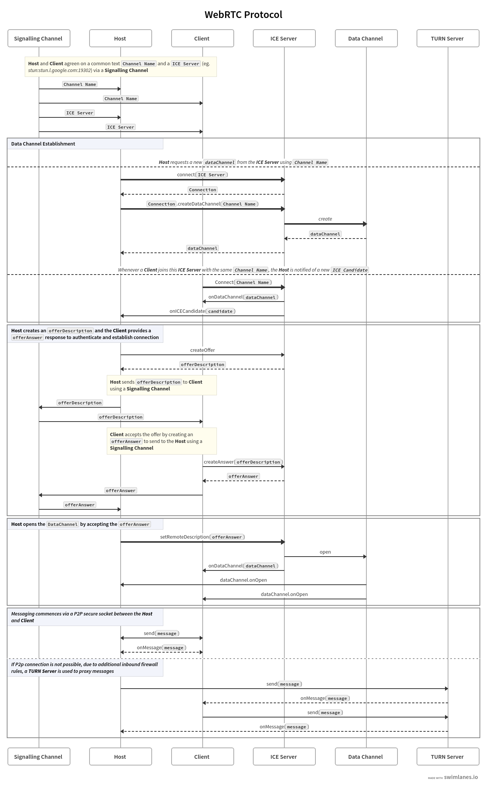

<p align="center">

 <h2 align="center">:package: xstate-machine-webrtc</h2>

<p align="center"><strong>WebRTC XState Machine Implementation</strong>✨</p>
  <p align="center">
    <a href="https://github.com/hebertcisco/ts-npm-package-boilerplate/issues">
      
    </a>
 <a href="https://github.com/hebertcisco/ts-npm-package-boilerplate">
      
    </a>
    <br />
    <br />
  </p>

# WebRTC Protocol

Source: [https://swimlanes.io/u/verzeXJwO](https://swimlanes.io/u/verzeXJwO)


# Getting started

## Installation

```
yarn add xstate-machine-webrtc
```

## 🤝 Contributing

Contributions, issues and feature requests are welcome!<br />Feel free to check [issues page](issues).

## Show your support

Give a ⭐️ if this project helped you!

## 📝 License

This project is [MIT](LICENSE) licensed.
